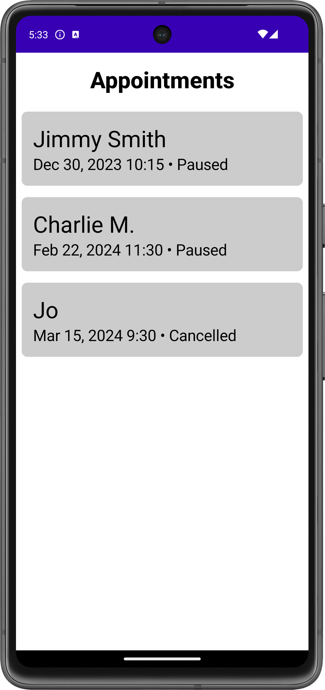
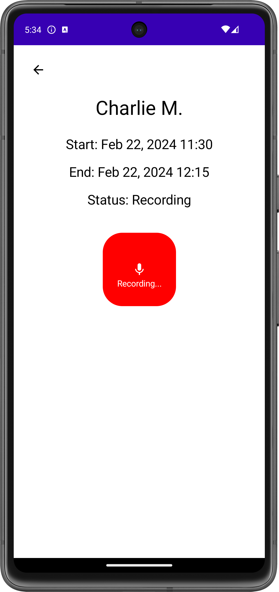
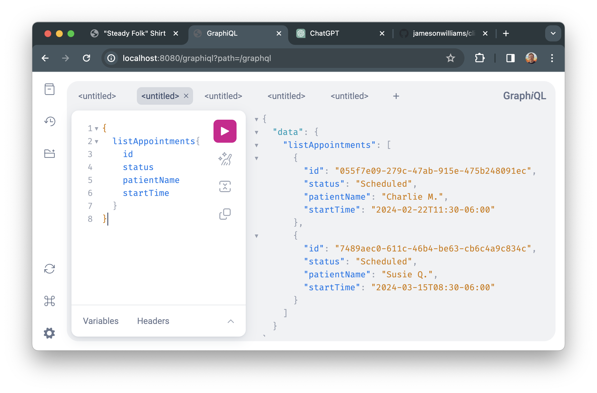

# Clinician's Recording App

This is a toy app that displays appointment data for clinicians. The app
is split between an [Android client](AndroidApp) and a [GraphQL
backend](Backend).

This project was completed as part of an application to [Ambience
Healthcare](https://www.ambiencehealthcare.com/).

The project requirements can be found [on
Notion](https://www.notion.so/Mobile-Take-home-Ambient-Recording-App-for-Clinicians-0db65cb8728f4f1b8d6abeb13d81a60c?pvs=5).

## Android App
| App Appointment List | App Recording View |
|--|--|
| |  |

The [Android App](./AndroidApp) is "offline first," and always displays
data from its local database. The data in the database can either be
updated through user interactions (such as when the user toggles the
appointment status), or by remote updates on the server.

### Client Sync Protocol

The client state and the server state can drift apart when the
app is offline. To address this, the app needs to reconcile the
application state with the server.  Whenever the app [enters the
foreground](https://github.com/jamesonwilliams/clinicians/blob/b8fb5cb218375bdaef946d1b99cf753d08de4af5/AndroidApp/app/src/main/java/org/nosemaj/cra/data/sync/AppointmentSyncEngine.kt#L32),
it starts listening to the OS for network connectivity. In addition to
an initial sync, the app attempts to sync whenever it [regains network
connectivity](https://github.com/jamesonwilliams/clinicians/blob/b8fb5cb218375bdaef946d1b99cf753d08de4af5/AndroidApp/app/src/main/java/org/nosemaj/cra/data/sync/AppointmentSyncEngine.kt#L38).
The sync procedure goes through these steps:

1. "Cleanup". Cancel any previous data transfer jobs that may exist.
2. "Base sync". Send the client's version of the appointment list to the
   server. The server will perform conflict resolution and send back an
   updated list. Apply the server's view of appointments immediately to
   the database.
3. "Delta sync". Begin listening to the server over a websocket for any
   incremental updates that occur after the base sync.

The client may update an appointment's local status at any point, due to
user interaction. The client [saves the new
status](https://github.com/jamesonwilliams/clinicians/blob/b8fb5cb218375bdaef946d1b99cf753d08de4af5/AndroidApp/app/src/main/java/org/nosemaj/cra/data/AppointmentRepository.kt#L24)
optimistically, and increases the local `lastUpdated` field when it does
so. Updating the `lastUpdated` field ensures that the local copy of the
appointment will not be overwritten during the next sync. In addition,
the client immediately tries to modify the object on the server, to
catch it up before the next sync. This call may fail if the app is
offline--but it will be synced upon coming back online, anyway. 

### Working with the Client

#### Build and Run
To build and run the client (if you don't want to use Android Studio, instead):

```console
cd AndroidApp
./gradlew clean app:installDebug
adb shell am start -n org.nosemaj.cra/org.nosemaj.cra.ui.MainActivity
```

#### Update Endpoint

See the notes below about how to run the web server locally. Be sure to
update the Android app's `strings.xml` to point to your local web server:
```xml
<resources>
    <string name="gql_base_url">http://YOUR_LOCAL_IP:8080/graphql</string>
    <string name="gql_subscription_base_url">http://YOUR_LOCAL_IP:8080/graphql</string>
</resources>
```

#### Working with Schema

To pull the server's schema into the client project, and generate
updated Kotlin models based on it:
```console
./gradlew :app:downloadApolloSchema \
    --endpoint='http://localhost:8080/graphql' \
    --schema=app/src/main/graphql/schema.graphqls
./gradlew app:generateApolloSources
```

## Backend

| Backend GraphiQL interface |
|---|
| |


### Server Sync Protocol

The server is the ultimate authority on the application state.  The server notifies the
client of the canonical application state either through its response to
the the sync mutation, or by delta updates over the realtime
subscription.

The backend considers the list of client appointments and applies the
following [logic to create a resolved
list](https://github.com/jamesonwilliams/clinicians/blob/b8fb5cb218375bdaef946d1b99cf753d08de4af5/Backend/src/main/kotlin/org/nosemaj/cra/service/AppointmentService.kt#L31):
1. If an appointment only exists on the client or server, it
   is included in the resolved set;
2. If the appointment is on both the client and server, whichever
   version has a more recent `lastUpdated` value will be used.
   (See discussion of caveats below.)

In addition, the server accepts ModifyAppointment mutations. These
mutations may be triggered by the Android app or by the GraphiQL admin
interface.  The server will [immediately
broadcast](https://github.com/jamesonwilliams/clinicians/blob/b8fb5cb218375bdaef946d1b99cf753d08de4af5/Backend/src/main/kotlin/org/nosemaj/cra/service/AppointmentService.kt#L17)
any modified appointments over GraphQL subscription, if active. The
modified appointments will also be returned during the next sync
operation, if they have the most recent `lastUpdated` value at that
time.

### Conflict Resolution Caveats

There are a number of different ways to handle conflicts between
appointments on the client and server. Currently, the app resolves
conflicts by picking whichever version has been updated more recently.
This is a simple strategy, but it does have some downsides.

For one, it assumes that the client and server agree on a clock, which
may or may not be true. This could be de-risked by adding timing info in
the sync command so that the two can agree on an offset.

Another downside is that it is not resilient to some more complex update
scenarios, where both the client and server versions have been
meaningfully updated while out-of-touch. Consider the following sequence
of events:
   1. At time 1, the client goes offline
   2. At time 2, the server cancels an appointment
   3. At time 3, the client begins recording for that appointment, updating its state
   4. At time 4, the client comes back online and performs a sync

In this sequence, the client will end up preserving its recording
status, even though the server tried to cancel the appointment.
Perhaps we would have liked to mark the appointment as canceled in this
scenario, instead.

Long term, these nuanced decisions should continue to be made by more
elaborate conflict resolution implemented on the server.

### Working with the Backend 

For ease of development and testing, the server initializes itself with
a few fake appointments. You can further update them "on the backend" by
using the GraphiQL interface at http://localhost:8080/graphiql. Some
useful queries and mutations are noted below.

#### Run the Server
To build and run the server, if you don't want to use IntelliJ IDEA
instead:

```console
cd Backend
./gradlew clean build bootRun
```

#### List appointments

```graphql
{
  listAppointments{
    id
    status
    patientName
    startTime
  }
}
```

#### Add an appointment

```graphql
mutation {
  addAppointment(
    patientName: "Bonnie Douglas"
    startTime: "2024-02-04T10:15:00-06:00"
    endTime: "2024-02-04T10:55:00-06:00"
  ) {
    id
  }
}
```

#### Modify an appointment

```graphql
mutation {
  modifyAppointment(
    id: "7489aec0-611c-46b4-be63-cb6c4a9c834c",
    status: Cancelled,
    patientName: "Jon Friedman"
  ) {
    id
  }
}
```

## Technology Choices

The Android app is using a modern tech stack: Kotlin, Coroutines/Flow,
Jetpack Compose, MVI, Apollo Kotlin, Room database, Hilt. Most of these
are standard, uncontroversial choices for application development in
2024. I started it from my [Android List/Detail App Project
Template](https://plugins.jetbrains.com/plugin/23316-list-detail-app-project-template?noRedirect=true)
in the JetBrains plugin marketplace.

The backend is using Spring Boot, an in-memory H2 database, and the
basic Spring GraphQL library. I created the project using [Spring
Initializr](https://start.spring.io/).

* I chose Kotlin because it is modern, type-safe, and familiar.
* In the JVM ecosystem, some popular server frameworks are Spring Boot
and Ktor. I chose Spring Boot because I wasn't sure what-all I'd include
in the server to start, and wanted a broad ecosystem from which to draw
on tools and documentation.
* I chose an in-memory H2 database for simplicity.

I chose GraphQL because I needed real-time communication, and among
subscription solutions, GraphQL has some of the most robust tooling.
I'm also more familiar with it than I am with using bare WebSockets or
gRPC.

